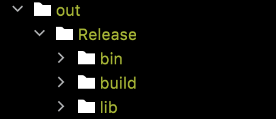
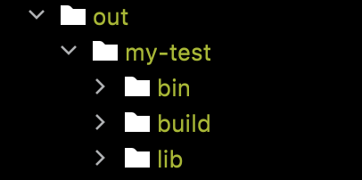

## Applications

So far we've got the following:

### printfiff -
Prints the contents of a fiff file in non-binary form.

### qfiff -
Quick lookup of tags, data types and block ids.

### anonymizer

Gets rid of PHI from fiff files. A feature-stripped reimplementation of [MNE Anonymize](https://github.com/mne-tools/mne-cpp).

## Libraries

### Core - 
Provides resources for dealing with endianness, strings, command line inputs.

### Fiff - 
Provides resources for reading from and writing to Fiff files.

## Building:

### Using the build script:

#### Compiling:
`./build <build-type> <build-name>`

If no build name is specified, the build will be named after the release type. If no release type is specified, it will default to 'Release'.

For example, to get a release build, run:

`./build Release`

And you get this:

and `./build Debug my-test` would get you this

#### Cleaning

To clean up, run `./build -c <build-name>` to remove that build. Run `./build -c` with no build name specified to clear all builds.