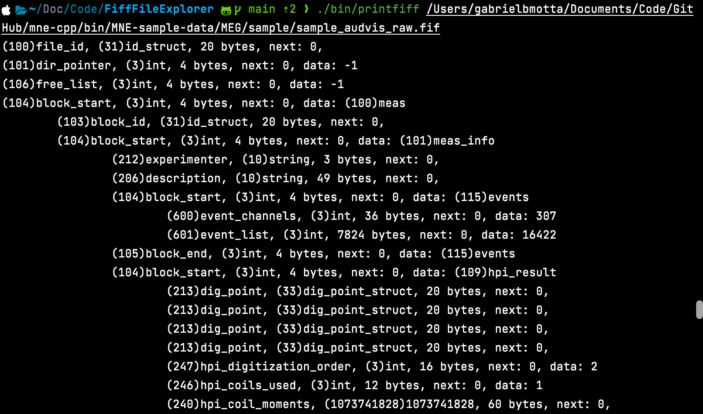
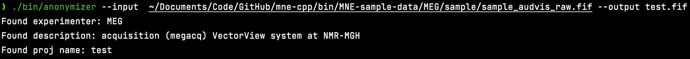

# Fiff

## Building

On mac, the build script might require the installation of the gnu core utils. This can be done through homebrew with `brew install coreutils`

### TLDR

Run the project script with the `--build` or `-b` flag:

```
./project --build
```

Your build be in `/out/Release`.

### Specifying build type

Run the project script with the `--type` or `-t` flag and specify the build type:

```
./project --build --type Debug
```

The build type must be capitalized. The script will default to 'Release' if the flag is not used.

### Sepcifying build name

Run the project script with the `--name` or `-n` flag and specify the build name:

```
./project --build --name my_name
```

Your build be in `/out/my_name`.

The build name will default to the selected build type if flag is not used.

### Cleaning

Run the script with the `--clean` or `-c` flag.

```
./project --clean
```

### I want to do it myself

Run cmake on the CMakeLists.txt in the src folder. Build the result of that.

```
cmake -Bbuild -Ssrc
cmake --build build 
```

## Libraries

### Core - 
Provides resources for dealing with endianness, strings, command line inputs.

### Fiff - 
Provides resources for reading from and writing to Fiff files.

## Applications

### printfiff -
Prints the contents of a fiff file in non-binary form.


### qfiff -
Quick lookup of tags, data types and block ids.


### anonymizer

Gets rid of PHI from fiff files. A feature-stripped reimplementation of [MNE Anonymize](https://github.com/mne-tools/mne-cpp).
